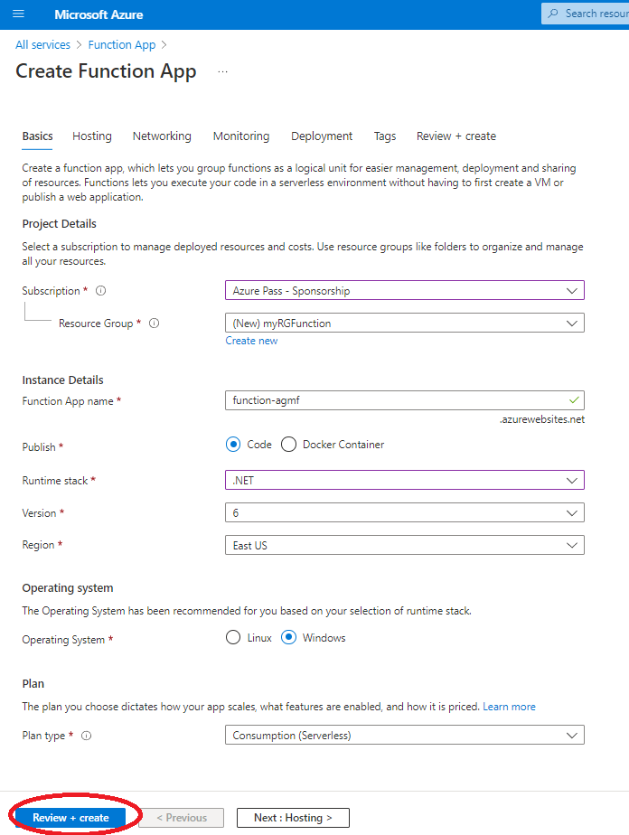
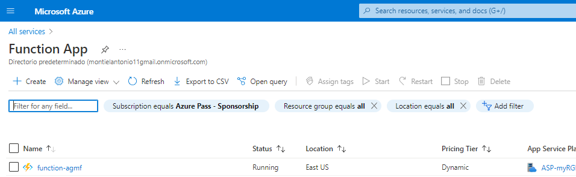
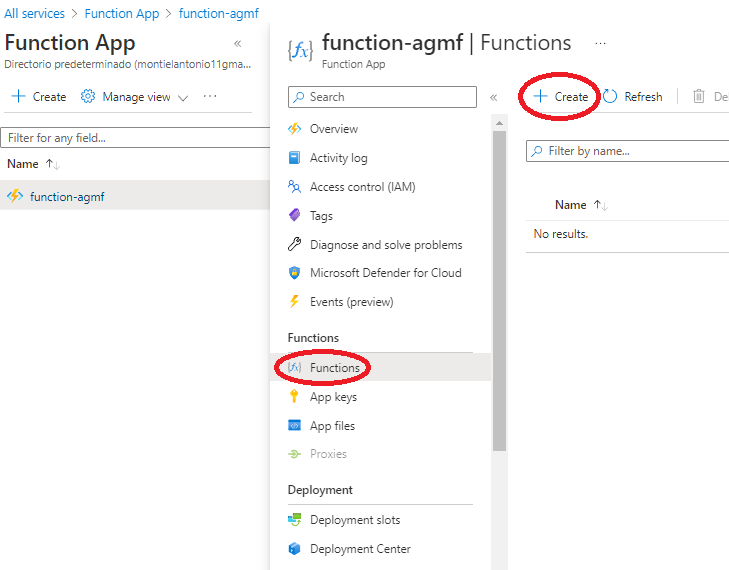

# Implementación de Azure Functions
En este tutorial, nos dispondremos a crear una aplicación de funciones para mostrar un mensaje de saludo cuando haya una solicitud HTTP.

# Parte 1: Crear una aplicación Functions

1. Inicie sesión en [Azure Portal](https://portal.azure.com/).

2. En el cuadro de texto **Buscar recursos, servicios y documentos**, en la parte superior del portal, busque y seleccione **Aplicación de funciones** y luego, desde la hoja **Aplicación de funciones**, haga clic en **Agregar**.

3. Creamos una con los siguientes parámetros, los demás se dejaran en predeterminado o vacíos al no ser obligatorios

   | **Configuración**           | **Valor**                            |
   | --------------------------- | ------------------------------------ |
   | Suscripción                 | el nombre de su suscripción de Azure |
   | Grupo de recursos           | myRGFunction                         |
   | Nombre de la aplicación     | function-agmf                        |
   | Publicar                    | Código                               |
   | Pila de tiempo de ejecución | NET Core                             |
   | Versión                     | 3.1                                  |
   | Región                      | Este de EE.UU                        |

   

Le damos a revisar y crear y comprobamos que se haya desplegado bien volviendo a **Home > Function App**

Una vez dentro de nuestra Function App seleccionamos Functions y añadimos una nueva:

